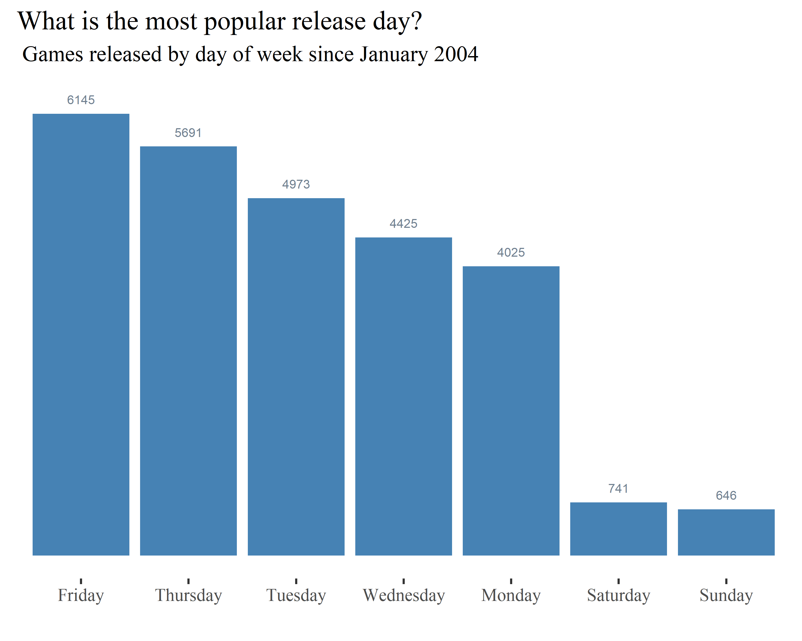
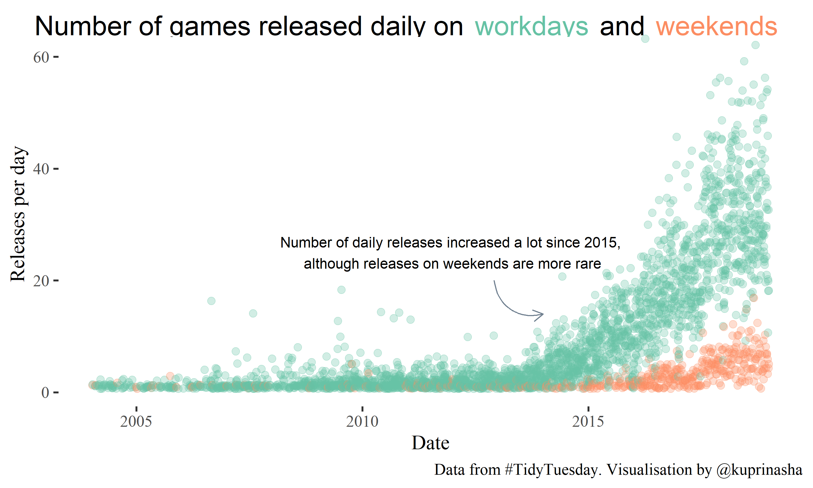

# tidytuesday-video-games
Using SteamSpy data, I was interested in seeing how many games are reeleased on daily basis. There was a clear trend in some days having higher number of new releases than others. It appears that most popular release day is Friday, followed by Thursday!

## Total releases by dates

The trend highlighted that there are a lot less releases on the weekends compared to the weekdays:

Original data: https://github.com/rfordatascience/tidytuesday/tree/master/data/2019/2019-07-30 

Libraries used: 

- tidyverse
- lubridate
- ggthemes
- magrittr
- gridExtra
- ggrepel
- glue
- grid
